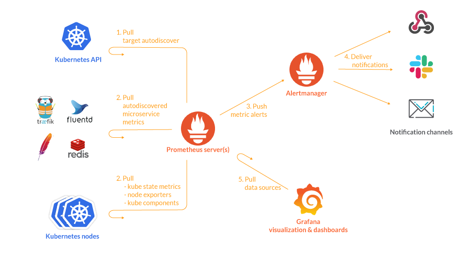

## Pasos de Instalación

### 1. Añadir el repositorio de Helm
```bash
helm repo add prometheus-community https://prometheus-community.github.io/helm-charts
helm repo update
```

### 2. Instalar Kube Prometheus Stack
```bash
helm install kube-prometheus-stack prometheus-community/kube-prometheus-stack --namespace monitoring --create-namespace
```

### 3. Verificar la instalación
```bash
kubectl get pods --namespace monitoring
```

### 4. Realizar Port Forward para acceder al servicio
```bash
kubectl port-forward --namespace monitoring svc/kube-prometheus-stack-prometheus 9090:9090
```

# Guía sobre Kube Prometheus Stack y Grafana

## 1. **Kube Prometheus Stack (Prometheus y Componentes Relacionados)**

El Helm chart `kube-prometheus-stack` es un paquete que instala un conjunto de herramientas de monitorización que trabajan juntas para proporcionar una solución completa de observabilidad en Kubernetes. Este stack incluye:

### **Prometheus**
- Sistema principal de monitorización y alertas.
- Recolecta y almacena métricas de tus aplicaciones y del clúster de Kubernetes.
- Diseñado para recolectar métricas en intervalos de tiempo.
- Permite crear alertas y gráficos basados en estas métricas.

### **Alertmanager**
- Gestiona las alertas generadas por Prometheus.
- Configurable para enviar notificaciones a través de diferentes canales como:
  - Email
  - Slack
  - PagerDuty, entre otros.

### **Grafana**
- Herramienta de visualización utilizada para crear dashboards.
- Muestra las métricas recolectadas por Prometheus.
- Altamente configurable y permite:
  - Crear gráficos complejos.
  - Configurar alertas basadas en las métricas de Prometheus.

### **Kube-state-metrics**
- Componente esencial para obtener las métricas de estado del clúster de Kubernetes.
- Recolecta métricas sobre el estado de recursos como:
  - Deployments
  - Pods
  - Namespaces
- Proporciona métricas clave que describen el estado de estos objetos, esenciales para dashboards en Grafana.

### **Node-exporter**
- Recolecta métricas a nivel de nodo (máquina).
- Incluye métricas como:
  - Utilización de CPU
  - Memoria
  - Disco, entre otros.
- Estas métricas son esenciales para monitorizar la salud de los nodos de tu clúster Kubernetes.

---

## 2. **Grafana (Instalación por Separado)**

Si decides instalar Grafana por separado, puedes hacerlo utilizando su propio Helm chart (`grafana/grafana`). Esto podría ser necesario en los siguientes casos:
- Necesitas un control más granular sobre la configuración de Grafana.
- Requieres instalar una versión específica que no esté incluida en el `kube-prometheus-stack`.

### **Fuente de Datos (Data Source)**
- Una vez instalado Grafana, configúralo para usar Prometheus como fuente de datos.
- Esto permite que Grafana consulte las métricas almacenadas en Prometheus y cree dashboards para visualizarlas.

### **Dashboards**
- Grafana tiene la capacidad de importar dashboards preconfigurados.
- Hay muchos dashboards comunitarios diseñados específicamente para monitorizar clústeres de Kubernetes utilizando Prometheus como backend de datos.
- Estos dashboards están optimizados para mostrar métricas importantes, como:
  - `namespace_workload_pod`
  - Métricas recolectadas por `kube-state-metrics`, entre otras.


</br>
</br>
</br>


