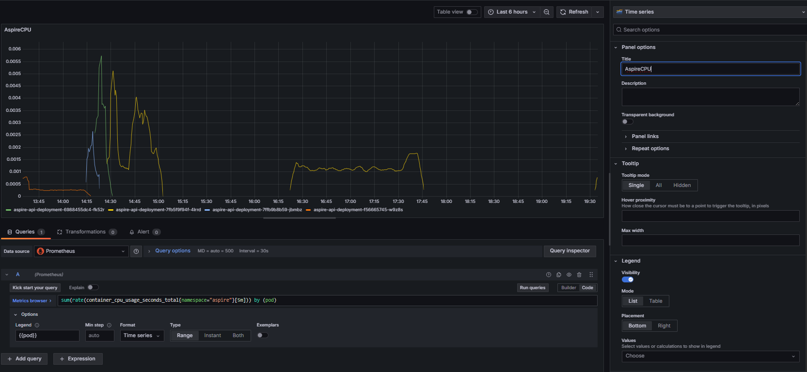

# Creamos un  dashboard custom de métricas de cpu y memoria

Vamos a coger las metricas de cpu y memoria

```bash
sum(rate(container_cpu_usage_seconds_total{namespace="aspire"}[5m]))
sum(container_memory_usage_bytes{namespace="your-namespace"}) by (pod)

```

